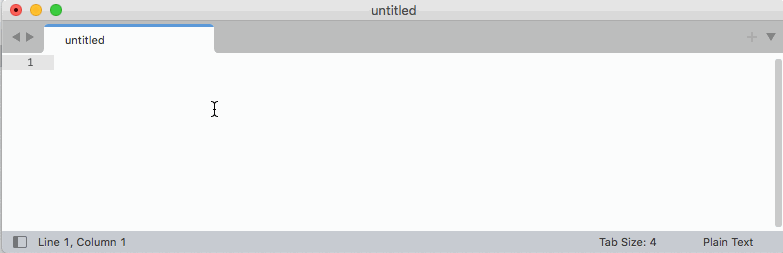

# StatusBarJsonPath
Sublime Text plugin to get the JSONPath (a notation to access the item) under the cursor in a JSON.

The plugin also includes a command _JSONPath: Copy_ to copy the displayed path to the clipboard.

## Example

Given the following JSON object:
```
{
	"name": "Hello World",
	"tags": [
		"example"
	],
	"metadata": {
		"author": "Alex Kirk"
	}
}
```
In this scenario the plugin will display/copy the following JSONPaths (all directly queryable in [`jq`](https://jqlang.github.io/jq/) for matching results):

- Cursor inside "name": `.name`
- Cursor inside "Hello World": `.name`
- Cursor inside "tags": `.tags`
- Cursor inside "example": `.tags[0]`
- Cursor inside "metadata": `.metadata`
- Cursor inside "author": `.metadata.author`

## Demo


## Installation

On PackageControl it's called `Status Bar JsonPath`: https://packagecontrol.io/packages/Status%20Bar%20JsonPath

1. Run `Package Control: Advanced Install Package`
2. Enter `Status Bar JsonPath`

You can also install the package manually like this:

1. Click the *Preferences >Browse Packages…* menu, this should open a folder `Packages`.
2. Download https://github.com/akirk/StatusBarJsonPath/archive/refs/heads/main.zip and extract it into that directory (it should then have a subfolder `StatusBarJsonPath-main`).
3. Restart Sublime Text.
